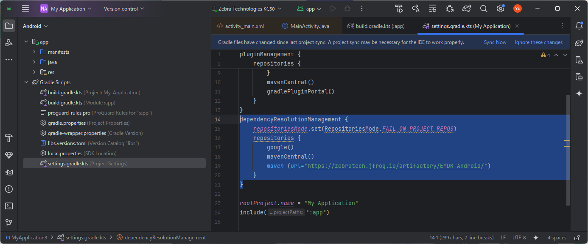

# ゼブラ・アンドロイド端末の初心者向け開発ガイド
Zebra-Android_Developer Guide for Beginners v1.00

# はじめに

</br>

本書は、Zebra Android端末（A13以上）向けネイティブ・アプリケーション開発者向け簡易ガイドです。Zebra EMDKを通して、開発に必要なソフトウェアの入手方法、セットアップ手順、及びSDKのサンプルプログラムについて解説します。

Android 向けのNativeアプリケーション・プログラムにはJava/Kolin などの開発言語が利用可能です。本書におきましてはjava 言語で開発することを前提に作成されています。java以外の開発言語をご利用の際は、関連のドキュメントや情報源を参照ください。
</br>
</br>

# Zebra EMDK

Zebra EMDKは、Zebra Technologiesが提供するエンタープライズ モビリティ開発キット(Enterprise Mobility Development Kit)の略で、Zebra製のAndroidモバイルコンピュータ向けにビジネスアプリケーションの開発をサポートするソフトウェアです。

通常のAndroidデバイスでは利用できないZebraデバイス固有のハードウェア機能や設定に、アプリからアクセスできるようにするためのSDK（ソフトウェア開発キット）とライブラリを提供します。
</br>
</br>

### EMDKの主な目的と機能

EMDKの主な目的は、**開発者がZebraデバイスの機能を最大限に活用し、業務に特化した効率的なアプリケーションを簡単に構築**できるようにすることです。

<table border="1" style="width:100%; border-collapse: collapse;">
  <thead>
    <tr>
      <th style="padding: 8px; background-color: #f2f2f2; text-align: left;">カテゴリー</th>
      <th style="padding: 8px; background-color: #f2f2f2; text-align: left;">機能</th>
      <th style="padding: 8px; background-color: #f2f2f2; text-align: left;">詳細</th>
    </tr>
  </thead>
  <tbody>
    <tr>
      <td rowspan="5" style="padding: 8px;">Zebraデバイス固有の機能へのアクセス</td>
      <td style="padding: 8px;">バーコードスキャナー</td>
      <td style="padding: 8px;">Zebraデバイスに内蔵されている高性能バーコードスキャナー（1D/2D Imagerなど）をアプリから直接制御し、高速かつ正確なスキャンを実行できます。Android標準のカメラを使ったスキャンとは一線を画します。</td>
    </tr>
    <tr>
      <td style="padding: 8px;">RFIDリーダー</td>
      <td style="padding: 8px;">RFIDリーダーを内蔵または接続しているZebraデバイスで、RFIDタグの読み取り・書き込みを制御します。</td>
    </tr>
    <tr>
      <td style="padding: 8px;">周辺機器管理</td>
      <td style="padding: 8px;">物理キーボード、特定のLEDインジケーター、プリンター、バッテリー情報など、デバイス固有のハードウェアコンポーネントを管理できます。</td>
    </tr>
    <tr>
      <td style="padding: 8px;">電源管理</td>
      <td style="padding: 8px;">バッテリーの状態を詳細に取得したり、電源管理の設定を行ったりできます。</td>
    </tr>
    <tr>
      <td style="padding: 8px;">高度な設定</td>
      <td style="padding: 8px;">デバイス設定（例：Wi-Fi設定の最適化、ディスプレイのタイムアウトなど）をアプリからプログラムで変更できます。</td>
    </tr>
    <tr>
      <td rowspan="2" style="padding: 8px;">開発の効率化</td>
      <td style="padding: 8px;">GUIベースの開発ツール</td>
      <td style="padding: 8px;">Android Studioに組み込まれるGUIベースのツール（Profile Managerなど）を通じて、一部の設定をコードを書かずに構成できます。これにより、開発時間や手間、エラーを削減します。</td>
    </tr>
    <tr>
      <td style="padding: 8px;">サンプルコードとドキュメント</td>
      <td style="padding: 8px;">EMDKには、さまざまな機能のサンプルアプリケーション（ソースコード付き）や、詳細なドキュメントが含まれており、開発者が迅速に学習し実装を進めることができます。</td>
    </tr>
    <tr>
      <td rowspan="2" style="padding: 8px;">エンタープライズアプリケーションの実現</td>
      <td style="padding: 8px;">幅広い業界での利用</td>
      <td style="padding: 8px;">小売、倉庫、物流、製造、医療、公共サービスなど、多様な業界におけるミッションクリティカルな業務アプリケーションの開発に利用されます。</td>
    </tr>
    <tr>
      <td style="padding: 8px;">生産性と信頼性</td>
      <td style="padding: 8px;">堅牢なデバイスとEMDKの組み合わせにより、現場での高い生産性と信頼性を実現します。</td>
    </tr>
  </tbody>
</table>
</br>
</br>


### EMDKが重要な理由
**一般的なAndroid SDKだけでは、Zebraデバイスの高性能なスキャナーやRFIDリーダーといった特別なハードウェア機能をフル活用することはできません。** EMDKは、これらの機能をアプリから直接制御するための「橋渡し」となる役割を果たします。これにより、Zebraの堅牢なデバイスが持つ潜在能力を最大限に引き出し、ビジネスの現場で求められるパフォーマンスと信頼性を提供できるのです。

EMDKの詳細な機能やビジネス課題への解決策については、こちらの動画も参考になります。

[Zebra: Enterprise Mobility Developer Kit (EMDK) Overview](https://www.youtube.com/watch?v=O0SdKNQEn9M)

</br>
</br>

# 開発の流れ

Zebra Android 端末向けにネイティブアプリケーションを開発する場合の一般的な流れは下記の通りです。本頁では下記プロセスについて、１つ１つ説明をいたします。

1. 開発にあたって必要なマテリアルを用意
1. アプリ開発環境の構築
1. アプリの開発

# 開発にあたって必要なマテリアルを用意

#### 開発シーンやツールのバージョンに合わせて開発手法はいろいろありますが、本書では下記の環境で説明を進めていきます。

1. ハードウェア

    <table>
        <thead>
            <tr>
            <th>Items</th>
            <th>Remarks</th>
            </tr>
        </thead>
        <tbody>
            <tr>
            <td>Zebra Android端末</td>
            <td>Android 14</td>
            </tr>
            <tr>
            <td>Windows PC</td>
            <td>Win 10以上</td>
            </tr>            <tr>
            <td>Zebra プリンタ*</td>
            <td>Link-OS 7.1</td>
            </tr>
            <tr>
            <td>プリンタケーブル*</td>
            <td>ご利用のプリンタに適したUSBケーブル</td>
            </tr>
            <tr>
            <td>プリンタのサプライ*</td>
            <td>ラベル・リボン</td>
            </tr>
        </tbody>
        </table>

    \* ゼブラ社Link-OSプリンタ利用時。

  <br>


1. ソフトウェア

   <table>
    <thead>
      <tr>
        <th>Items</th>
        <th>Remarks</th>
      </tr>
    </thead>
    <tbody>
      <tr>
        <td>統合開発環境</td>
        <td>Android Studio Narwhal 2025.1.1</td>
      </tr>
      <tr>
        <td>Zebra Android 開発ツール </td>
        <td>Zebra EMDK for Android 13.0</td>
      </tr>
      <tr>
        <td>Zebra プリンタ開発ツール*</td>
        <td>Link-OS Multiplatform SDK 2024 Sep</td>
      </tr>
      <tr>
        <td>Zebra プリンタデザインツール*</td>
        <td>ZebraDesigner3 Developers v3.2.2 </td>
      </tr>
      <tr>
        <td>Zebra プリンタ設定ツール*</td>
        <td>Zebra Setup Utilities version 11.9.*</td>
      </tr>
    </tbody>
    </table>

<br><br>


# アプリ開発環境の準備

Windows PC に開発に必要なソフトウェアをインストールします。

<br>

1. Android Studio のインストール

下記リンクに従って、アプリケーション開発ソフトウェアをダウンロードし、インストールします。Google の規約や手順に従って、Android Studio をWindows PC にインストールください。

https://developer.android.com/


## Android Studioの開発環境構築

Android Studioにて、Link-OS SDKが利用できるようにします。本ページと開発環境が異なる場合は、下記リンクを参考に設定をしてください。

[Zebra EMDK Setup / EMDK For Android 13.0](https://techdocs.zebra.com/emdk-for-android/13-0/guide/setup/)

<br>

1. 新規Android Projectを作成する。
    

    </br>

1. EMDK for Android のPluginをインストールする。  
    File > Settings > Plugin > EMDK for Android

    </br>

1. build.gradle.kts(Module:app)を編集します。 

    ``` java
    //  利用するEMDKのバージョンを記載する ‘com.symbol:emdk:9.1.1’
    dependencies {
       compileOnly("com.symbol:emdk:x.x.x") 
            ...
    }
    ```

    
    
    </br>

1. Setting.gradle.ktsを編集します。
    ```java
    // Gradle Plugin接続を設定する。
    dependencyResolutionManagement {
    repositoriesMode.set(RepositoriesMode.FAIL_ON_PROJECT_REPOS)
    repositories {
        google()
        mavenCentral()
        maven (url="https://zebratech.jfrog.io/artifactory/EMDK-Android/")
        }
    }
    ```

    

    </br>

1. AndroidManifest.xmlを編集します。

    ```java
    <manifest xmlns:android="http://schemas.android.com/apk/res/android"
    xmlns:tools="http://schemas.android.com/tools">
    
    // EMDKの利用権限設定
    <uses-permission android:name="com.symbol.emdk.permission.EMDK" />
    // Android 11以上では下記設定も必要
    <queries>
        <package android:name="com.symbol.emdk.emdkservice" />
    </queries>
    ...
    </manifest>
    ```

    
    
    </br>

1. Sync Now を選択し、編集した内容を開発環境に反映します。
    
    </br>

1. これで、EDMKのAPIがご利用可能になります。

    


</br>
</br>


## アプリの開発

開発環境の構築ができ、APIの利用ができるようになれば、コードを書いて、アプリの開発ができるようになります。アプリ開発において、有用な情報源を表記しますので、必要に応じて参照してみてください。

</br>

### Android 開発の基本について

[Google: Android Studio](https://developer.android.com/studio?hl=ja)  
Android Studioを用いた開発情報が多く掲載されています。初心者向けにスタートガイドが用意されており、初めての方でも安心して取り組める工夫がされています。


</br>

### Zebra Android 端末について

[Zebra: Techdocs](https://techdocs.zebra.com/#gsc.tab=0)  
開発をする上ではEMDKだけではなく、Datawedge、EHS、OEMConfigなどのツールや機能もご利用になることが多いと思います。また、プリンタ、外部スキャナやセンサーなどと連携することもあると思います。そのようなときに参照すべき情報が集積されているサイトとなります。

</br>

### サンプルコードの入手先

[Zebra TechDocs: Samples](https://techdocs.zebra.com/emdk-for-android/13-0/samples/)  
基本的な機能について開発するためのサンプルコード集が揃っていますので、Zebra Android端末のビギナーに最適なサイトです。

[Developers Portal: Enterprise Mobile Computing](https://developer.zebra.com/products/enterprise-mobile-computing)  
Android端末に関する開発情報が豊富なサイトです。Nativeアプリだけではなく、Enterprise Browserなどのブラウザアプリ、スキャナ設定ツール（Datawedge）、アプリ機能制限ツール（EHS）などの企業向けツールについても詳細に説明されています。

[git-hub: Zebra Devs](https://github.com/ZebraDevs)  
ゼブラ製品向けの有用なサンプルコードを公開しています。より、実用的なコードが多いので、ワンランク上のアプリをお求めの際は参照するとよいかもしれません。

    
</br>

